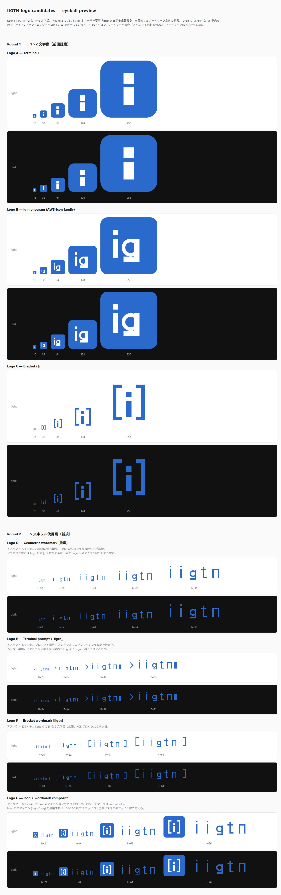
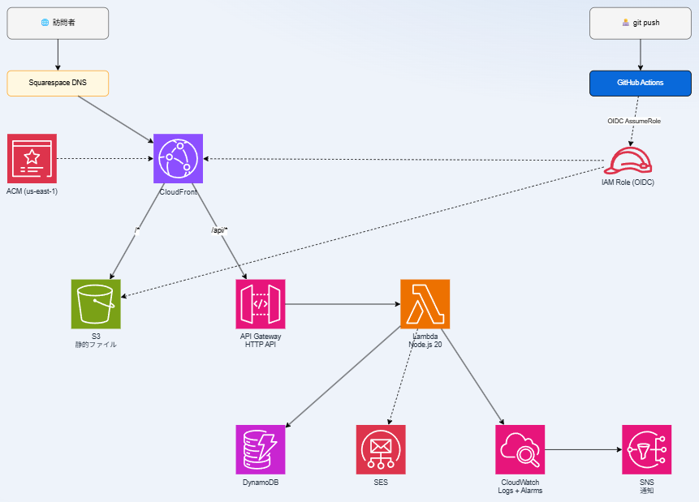

# iigtn-platform

フリーランス・インフラエンジニア **iigtn** が設計・構築・運用する、AWS サーバレス構成のポートフォリオサイト本体のリポジトリです。

> サイト本体の動作と全構成コードを公開することで、技術選定・運用品質・コスト感の妥当性を第三者が検証可能な状態にしています。

| 項目 | 内容 |
|---|---|
| 公開 URL | <https://www.iigtn.com> ・ <https://lab.iigtn.com> （同一コンテンツ） |
| Apex (`iigtn.com`) | Squarespace で 301 リダイレクト → `www.iigtn.com` |
| ステータス | Live（無人自動運用） |
| 技術スタック | AWS（S3・CloudFront・API Gateway・Lambda・DynamoDB・SES・Route 53・ACM・CloudWatch・SNS）/ Terraform / GitHub Actions OIDC |
| ライセンス | MIT — [LICENSE](./LICENSE) |



---

## サイト内コンテンツ

| カテゴリ | 公開ページ |
|---|---|
| プロフィール | [About](https://www.iigtn.com/about.html) ・ [Skills](https://www.iigtn.com/skills.html) |
| 実績 | [Works](https://www.iigtn.com/works.html) （/projects/ 配下に各プロジェクトの構成解説 8 ページ） |
| ブログ | [構築日誌（全 21 記事）](https://www.iigtn.com/blog/) ・ [AWS 基本サービス入門（全 15 記事）](https://www.iigtn.com/blog/aws-basics/) ・ [現場コマンドリファレンス（全 19 記事）](https://www.iigtn.com/blog/ref/) |
| 解説書 | [このサイトの構築解説（採用評価向けの詳細版）](https://www.iigtn.com/learn.html) |
| お問い合わせ | [Contact](https://www.iigtn.com/contact.html) |

---

## アーキテクチャ

AWS 公式アイコン (v2026) で作成した構成図です。



ソース: [`frontend/diagrams/04-overall-architecture.drawio`](./frontend/diagrams/04-overall-architecture.drawio)（drawio で編集可能 / GitHub 上でクリックすると同じ構成が描画されます）

---

## 採用技術と役割

| レイヤー | サービス | 役割 |
|---|---|---|
| ドメイン | `iigtn.com`（apex）/ `www.iigtn.com` / `lab.iigtn.com` | apex は Squarespace で 301 → www、www / lab は CloudFront で同一コンテンツ配信 |
| DNS | Route 53 + Squarespace DNS | `*.iigtn.com` のサブドメイン管理。apex は Squarespace 管理（Workspace バンドル制約） |
| 配信 | CloudFront（OAC） | TLS 終端 / キャッシュ / ヘッダー / SPA リライト |
| 証明書 | ACM (us-east-1) | `*.iigtn.com`、自動更新 |
| 静的 | S3（Public Access Block 全 ON） | HTML / CSS / JS / 画像。CloudFront 経由のみ参照可能 |
| API | API Gateway HTTP API | 問い合わせフォーム経路 |
| 計算 | Lambda（Node.js 20 / arm64 / 256 MB） | フォーム処理（バリデーション / DDB 書き込み / SES 送信） |
| データ | DynamoDB（On-Demand + PITR） | 問い合わせ履歴 |
| メール | SES | フォーム送信先（DKIM / SPF / DMARC 構成） |
| 監視 | CloudWatch + SNS | エラー / レイテンシアラーム → Email 通知 |
| 認証 | IAM + OIDC（GitHub Actions） | 静的アクセスキーゼロ。push 時のみ短期クレデンシャル発行 |
| IaC | Terraform | 全リソースをコード管理（S3 backend + DynamoDB Lock） |
| CI/CD | GitHub Actions | `main` push → S3 sync + CloudFront invalidation 自動実行 |
| アナリティクス | Google Analytics 4 (gtag.js) | PV / 流入経路 / 滞在時間の計測 |

---

## 設計の柱

### 1. セキュリティ最小権限

- **S3 を直接公開しない**: Public Access Block 全 ON、CloudFront の Origin Access Control 経由のみ
- **静的アクセスキーを発行しない**: GitHub Actions は OIDC で `AssumeRoleWithWebIdentity`、有効期限つき短期クレデンシャル
- **IAM 最小権限**: Lambda の権限は対象 DynamoDB テーブル ARN まで具体化、CloudFront 用 IAM は Distribution ID で限定
- **全層暗号化**: S3（SSE-S3）/ DynamoDB（KMS）/ Terraform State（S3 暗号化 + DynamoDB Lock）/ TLS 1.2 以上

### 2. 無人運用前提の自動化

- ドメイン取得 → 証明書発行 → CloudFront 配信 → 問い合わせ受信 → ログ集約 → アラーム → メール通知 までが Terraform で完結
- `main` ブランチへの push が唯一のデプロイトリガー（手作業の `aws s3 cp` 等は緊急時のみ）
- CloudFront のキャッシュ無効化はワイルドカード `/*` 指定で反映漏れを防止

### 3. 設計判断の記録

- 各構成の採用理由・採用しなかった選択肢を [docs/](./docs) 配下にドキュメント化
- 全 21 記事の構築日誌で「ハマりどころ・解決手順・学び」を一次記録として公開（[blog/](https://www.iigtn.com/blog/)）

---

## 月額運用コスト

実トラフィック・為替・無料枠で変動するため、**無風時 / 月間 PV 5,000 想定**の概算値です。詳細試算は [docs/cost.md](./docs/cost.md)、月次の実測値は [docs/metrics.md](./docs/metrics.md)。

| サービス | 月額（円・概算） |
|---|---:|
| Route 53 Hosted Zone | 約 75 |
| CloudFront 配信（5 GB / 50k リクエスト） | 約 95 |
| S3（1 GB + 数万リクエスト） | 約 6 |
| Lambda + API Gateway（無料枠内） | 0 |
| DynamoDB On-Demand（数十回 R/W） | < 5 |
| SES（数百通） | < 5 |
| CloudWatch Logs / Alarms / Budgets | 約 30 |
| **合計目安** | **約 200 〜 300 円** |

> ⚠️ Lambda・API Gateway は無料枠を超えると従量課金。ACM は CloudFront 用は無料、Route 53 のクエリは月数千円規模になるトラフィックでは無視できなくなります。

---

## ディレクトリ構成

```text
iigtn-platform/
├── README.md                          # 本ファイル
├── docs/
│   ├── motivation.md                  # 設計判断の背景
│   ├── cost.md                        # 月額コスト試算
│   ├── metrics.md                     # 実運用メトリクス（月次更新）
│   ├── runbook.md                     # 障害対応手順
│   ├── lessons.md                     # 失敗・妥協・学び
│   ├── adr/                           # Architecture Decision Records
│   ├── postmortem/                    # 障害振り返り
│   └── screenshots/
├── frontend/
│   ├── *.html                         # トップ / About / Skills / Works / Contact / Privacy / Learn
│   ├── projects/                      # 各プロジェクトの構成解説ページ
│   ├── blog/                          # 構築日誌 + AWS 基本サービス入門 + 現場コマンドリファレンス
│   ├── diagrams/                      # アーキテクチャ図（drawio + AWS 公式アイコン）
│   ├── assets/                        # アイコン / ロゴ / SNS ヘッダー
│   └── site.css
├── backend/
│   └── functions/                     # Lambda 関数
└── terraform/
    ├── modules/
    │   ├── network_dns/               # Route 53 + ACM
    │   ├── frontend_cdn/              # S3 + CloudFront + OAC
    │   ├── backend_api/               # API Gateway + Lambda + DynamoDB
    │   ├── messaging/                 # SES
    │   ├── observability/             # CloudWatch + SNS + Budgets
    │   └── ci_oidc/                   # GitHub Actions OIDC + IAM Role
    ├── envs/{dev,prod}/
    └── bootstrap/                     # State バケット初期化
```

---

## リポジトリ運用

- **デプロイ**: `main` ブランチへの push をトリガに GitHub Actions が `aws s3 sync` + `aws cloudfront create-invalidation /*` を実行（OIDC 経由のキーレス認証）
- **インフラ変更**: Terraform `modules/` 配下を変更 → `terraform plan` を PR で確認 → merge 後 `terraform apply`
- **ドキュメント**: [docs/](./docs) は人手更新、構築日誌は [`frontend/blog/`](./frontend/blog/) に直接配置

---

## 関連ドキュメント

| ドキュメント | 内容 |
|---|---|
| [docs/motivation.md](./docs/motivation.md) | この構成にした理由・揺らぎ・代替案を捨てた経緯 |
| [docs/cost.md](./docs/cost.md) | 月額コスト試算と最適化ポイント |
| [docs/metrics.md](./docs/metrics.md) | 実運用メトリクス（p95 / Hit 率 / Lambda Duration / Uptime / MTTD / MTTR） |
| [docs/runbook.md](./docs/runbook.md) | 障害対応手順 |
| [docs/lessons.md](./docs/lessons.md) | 構築・運用で得た学び・失敗 |
| [docs/adr/](./docs/adr/) | Architecture Decision Records |
| [docs/postmortem/](./docs/postmortem/) | 障害ポストモーテム |
| [構築日誌（全 21 記事）](https://www.iigtn.com/blog/) | このサイトをゼロから構築した過程の一次記録 |
| [解説書](https://www.iigtn.com/learn.html) | 採用評価向けの詳細解説（drawio 図インライン表示） |

---

## お問い合わせ

業務委託・技術相談・コードレビュー依頼などは <https://www.iigtn.com/contact.html> または `contact@iigtn.com` までお気軽にどうぞ。
