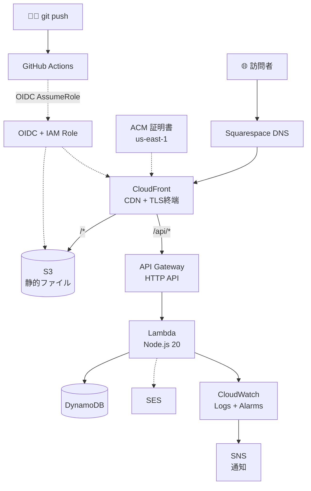

# iigtn.com — Serverless Portfolio Platform

> AWS サーバレス構成で運用する、フリーランス・インフラエンジニアのポートフォリオ兼活動基盤。

| Domain | Stack | IaC | CI/CD | Status |
|---|---|---|---|---|
| `iigtn.com` | S3 + CloudFront + Lambda + DynamoDB + SES | Terraform | GitHub Actions (OIDC) | Live（個人運用 / 月次メトリクス公開中） |

---

## ドキュメントマップ

技術概要は本 README、それ以外は用途別に分割しています。

| ファイル | 内容 |
|---|---|
| [README.md](./README.md) | 構成図 / 採用理由 / 採用しなかった選択肢（本ファイル） |
| [docs/motivation.md](./docs/motivation.md) | なぜこの構成にしたか — 個人の経験・仮説・揺らぎ |
| [docs/cost.md](./docs/cost.md) | 月額コスト試算と最適化 |
| [docs/metrics.md](./docs/metrics.md) | **実運用メトリクス（月次更新）** |
| [docs/runbook.md](./docs/runbook.md) | 障害対応 + 実際に起きた / 再現した障害ログ |
| [docs/lessons.md](./docs/lessons.md) | 失敗・妥協・技術的敗北・現在悩んでいること |
| [docs/business.md](./docs/business.md) | クライアント案件への展開構想（前提条件付き） |
| [docs/interview.md](./docs/interview.md) | 面接 Q&A（採用対策） |

---

## アーキテクチャ



> 詳細は [docs/iigtn/README.md](./docs/iigtn/README.md)（設計書 v5）参照。実運用解説は [https://lab.iigtn.com/learn.html](https://lab.iigtn.com/learn.html)。

---

## サービスの役割と採用理由

| 層 | サービス | 役割 | 採用理由 |
|---|---|---|---|
| DNS | Route 53 | iigtn.com 解決 | Alias で安価、ヘルスチェック連携も可 |
| 配信 | CloudFront | CDN + TLS 終端 | OAC で S3 を直接公開せずに済む（意図的な非公開設計）、SPA リライト対応 |
| 証明書 | ACM (us-east-1) | TLS 1.2+ | CloudFront 用は us-east-1 必須 |
| 静的 | S3 | HTML/JS/CSS/画像 | バージョニング+ライフサイクル |
| API | API Gateway HTTP API | Lambda の入口 | REST より安価、フォーム規模に十分 |
| 計算 | Lambda | 問い合わせ処理 | アイドル時ほぼ無料、自動スケール |
| データ | DynamoDB | 問い合わせ履歴 | Lambda と相性良、PII を PK にしない設計 |
| メール | SES | 送信 | DKIM/SPF/DMARC を Route53 で揃えられる |
| 監視 | CloudWatch | Logs/Metrics/Alarm | Lambda/API GW から自動で出る部分を活用 |
| 認証 | IAM (Role + OIDC) | 人/CI 権限分離 | GitHub Actions に静的キー無し |
| IaC | Terraform | 全リソース管理 | 採用市場で評価が高い |

詳細なコスト試算は [docs/cost.md](./docs/cost.md)、実運用値は [docs/metrics.md](./docs/metrics.md)。

---

## 採用しなかった選択肢

### Amplify
内部で同じ AWS リソースを使うが、抽象化が強くインフラ層がブラックボックス化する。**インフラエンジニアとしての設計力を可視化する目的** に対して逆効果。

### Vercel
Next.js を動かすだけなら最適だが、本プロジェクトの目的は **AWS の理解度を示すこと**。手段が目的と矛盾する。

### ECS / Fargate
コンテナ常駐が必要な API がない。最小構成でも常時 1,400 円/月発生し、VPC/ALB のレイヤー数も増える。年単位放置に向かない。

### EC2
月 600 円〜の常時課金、毎月の OS パッチ運用、バズ時の ALB+ASG 重装化が発生。EC2 力は別途 **検証用 EC2 を立てた記事** として訴求する方が効率的。

---

## セキュリティの 4 原則

> S3 直公開しない / 静的キーを発行しない / IAM 最小権限 / 全層暗号化

| 対策 | 効果 |
|---|---|
| S3 を CloudFront 経由のみに限定 (OAC) | 直 URL 流出を防ぐ意図的な設計 |
| GitHub Actions OIDC + AssumeRole | アクセスキーを Secrets に置かない |
| Lambda IAM 最小権限 | DynamoDB は特定テーブル ARN まで絞る |
| API Gateway Throttling | フォームが DDoS 踏み台にならない |
| DynamoDB KMS 暗号化 | 標準で AWS 管理キー |
| Terraform State 暗号化 + Lock | State には機密情報が含まれる |

> ⚠️ 「サーバレスだから安全」という誤解は避ける。Lambda ランタイム・Node ランタイム・npm 依存・OSS の脆弱性 は当然存在する。OS レイヤーの管理が不要なだけで、**アプリ層の SCA（依存スキャン）と SAST は別途必須**。

---

## クイックスタート（最初の 1 か月）

| 週 | やること |
|---|---|
| W1 | Terraform bootstrap + Route53 + ACM + S3 + CloudFront |
| W2 | サイト本体（Next.js / Astro）公開 |
| W3 | GitHub Actions で自動 deploy + ADR 1 本目 |
| W4 | Lambda + API GW + SES で問い合わせフォーム |

---

## ディレクトリ構成

```
iigtn-platform/
├── README.md
├── docs/
│   ├── motivation.md
│   ├── cost.md
│   ├── metrics.md
│   ├── runbook.md
│   ├── lessons.md
│   ├── business.md
│   ├── interview.md
│   ├── adr/
│   └── postmortem/
├── frontend/                       # Next.js or Astro
├── backend/                        # Lambda 関数
│   ├── functions/contact/
│   └── shared/
├── terraform/
│   ├── bootstrap/                  # state バケットのみ手動
│   ├── modules/
│   │   ├── network_dns/
│   │   ├── frontend_cdn/
│   │   ├── backend_api/
│   │   ├── messaging/
│   │   ├── observability/
│   │   └── ci_oidc/
│   └── envs/{dev,prod}/
└── .github/workflows/
    ├── frontend-deploy.yml
    ├── backend-deploy.yml
    ├── terraform-plan.yml
    └── terraform-apply.yml
```

---

## License
MIT — see [LICENSE](./LICENSE)

## Contact
`https://iigtn.com/contact` から問い合わせ可。
